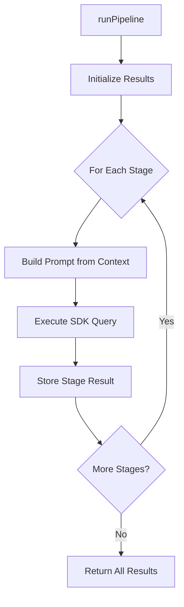

# @enterprise-agents/core

Shared SDK utilities and infrastructure for enterprise AI agents built with the Claude Agent SDK.

## Overview

This package provides reusable components that standardize agent development across the enterprise agent suite. It handles common concerns like CLI parsing, pipeline execution, logging, and output formatting.

## Installation

```bash
npm install @enterprise-agents/core
```

Or in a workspace:

```json
{
  "dependencies": {
    "@enterprise-agents/core": "*"
  }
}
```

## Features

- 🚀 **Pipeline Execution** - Multi-stage agent orchestration
- 📋 **CLI Argument Parsing** - Standardized command-line interface
- 📝 **Structured Logging** - Consistent console output with progress indicators
- 💾 **Output Management** - Dual-format file generation (txt + json)
- ✅ **Environment Validation** - API key checking and setup guidance
- 🎭 **Persona Context Building** - Reusable persona formatting

## Usage

### Environment Validation

```typescript
import { validateEnvironment } from '@enterprise-agents/core';

// Validates ANTHROPIC_API_KEY is present
validateEnvironment();

// Validates custom environment variables
validateEnvironment(['ANTHROPIC_API_KEY', 'CUSTOM_API_KEY']);
```

### CLI Argument Parsing

```typescript
import { parseCliArgs } from '@enterprise-agents/core';

const VALID_MODES = ['blog', 'social', 'campaign'];

const { topic, mode, additionalContext } = parseCliArgs(
  'Default Topic Here',  // Default if no args provided
  'blog',                // Default mode
  VALID_MODES            // Valid mode options
);

// Usage: npm start "My Topic" -- --mode social --context "B2B focus"
```

### Pipeline Execution

```typescript
import { runPipeline, StageConfig } from '@enterprise-agents/core';

const stages: StageConfig[] = [
  {
    name: 'Research',
    description: 'Gather information',
    systemPromptAppend: 'You are a research assistant...',
    allowedTools: ['WebSearch'],
    maxTurns: 15,
    maxBudgetUsd: 2.0,
    buildPrompt: (ctx) => `Research: ${ctx.topic}`
  },
  {
    name: 'Generation',
    description: 'Generate content',
    systemPromptAppend: 'You are a content writer...',
    allowedTools: [],
    maxTurns: 5,
    buildPrompt: (ctx) => `
      Based on research: ${ctx.previousResults['Research']}
      Generate content for: ${ctx.topic}
    `
  }
];

const results = await runPipeline(stages, {
  topic: 'AI in Healthcare',
  mode: 'blog',
  additionalContext: 'Focus on data privacy',
  previousResults: {}
});

console.log(results['Research']);
console.log(results['Generation']);
```

### Structured Logging

```typescript
import { logger } from '@enterprise-agents/core';

logger.header('My Agent Name');
logger.info('Starting process...');
logger.stageStart(1, 3, 'Research Stage');
logger.progress();  // Outputs dots for progress
logger.stageComplete('Research Stage');
logger.result('FINAL OUTPUT', content);
logger.saved('/path/to/output.txt');
logger.done('Process completed successfully!');
logger.error('Something went wrong', error);
```

### Output Management

```typescript
import { writeOutput, OutputConfig } from '@enterprise-agents/core';

const config: OutputConfig = {
  directory: './output',
  filenamePrefix: 'marketing-blog',
  includeJson: true,
  formatOutput: (topic, rawContent, metadata) => {
    return `
      ===========================
      ${topic}
      ===========================
      ${rawContent}
      
      Generated: ${metadata.generatedAt}
    `;
  }
};

const outputPath = writeOutput(
  config,
  topic,
  rawContent,
  jsonData,
  { 
    agentName: 'Marketing Agent',
    mode: 'blog',
    generatedAt: new Date().toISOString(),
    topic: 'AI in Healthcare'
  }
);

console.log(`Saved to: ${outputPath}`);
```

### Persona Context Building

```typescript
import { buildPersonaContext, PersonaBase } from '@enterprise-agents/core';

const persona: PersonaBase = {
  name: 'Atos Marketing',
  title: 'Senior Marketing Strategist',
  company: 'Atos',
  expertise: [
    'B2B Technology Marketing',
    'Content Strategy',
    'Digital Transformation'
  ],
  voiceGuidelines: [
    'Professional and authoritative',
    'Data-driven insights',
    'Clear and accessible'
  ]
};

const context = buildPersonaContext(persona);
// Returns formatted persona context for system prompts
```

## API Reference

### Functions

#### `validateEnvironment(requiredVars?: string[]): void`

Validates required environment variables are present. Exits with error message if missing.

**Parameters:**
- `requiredVars` - Array of environment variable names to validate (default: `['ANTHROPIC_API_KEY']`)

---

#### `parseCliArgs(defaultTopic: string, defaultMode: string, validModes: string[]): ParsedArgs`

Parses command-line arguments for topic, mode, and additional context.

**Parameters:**
- `defaultTopic` - Default topic if none provided
- `defaultMode` - Default mode if none provided
- `validModes` - Array of valid mode strings

**Returns:** `{ topic: string, mode: string, additionalContext?: string }`

---

#### `runPipeline(stages: StageConfig[], context: StageContext): Promise<Record<string, string>>`

Executes a multi-stage agent pipeline, passing results between stages.

**Parameters:**
- `stages` - Array of stage configurations
- `context` - Initial context including topic, mode, and previous results

**Returns:** Promise resolving to record of stage results

---

#### `writeOutput(config: OutputConfig, topic: string, rawContent: string, jsonData: Record<string, unknown>, metadata: OutputMetadata): string`

Writes agent output to timestamped files in both text and JSON formats.

**Parameters:**
- `config` - Output configuration
- `topic` - Content topic for filename
- `rawContent` - Raw content text
- `jsonData` - Structured data to save as JSON
- `metadata` - Metadata included in output

**Returns:** Path to saved text file

---

#### `buildPersonaContext(persona: PersonaBase): string`

Formats persona object into context string for system prompts.

**Parameters:**
- `persona` - Persona configuration object

**Returns:** Formatted persona context string

---

### Types

#### `StageConfig`

```typescript
interface StageConfig {
  name: string;                          // Stage identifier
  description: string;                   // Human-readable description
  systemPromptAppend: string;           // System prompt addition
  allowedTools: string[];               // Allowed Claude Code tools
  maxTurns: number;                     // Maximum agent turns
  maxBudgetUsd?: number;                // Optional budget limit
  buildPrompt: (ctx: StageContext) => string;  // Prompt builder function
}
```

#### `StageContext`

```typescript
interface StageContext {
  topic: string;                        // Main topic/request
  mode: string;                         // Agent mode
  additionalContext?: string;           // Optional context
  previousResults: Record<string, string>;  // Results from previous stages
}
```

#### `OutputConfig`

```typescript
interface OutputConfig {
  directory: string;                    // Output directory path
  filenamePrefix: string;              // Prefix for generated files
  includeJson: boolean;                // Whether to generate JSON file
  formatOutput: (                      // Output formatter function
    topic: string,
    rawContent: string,
    metadata: OutputMetadata
  ) => string;
}
```

#### `PersonaBase`

```typescript
interface PersonaBase {
  name: string;                        // Persona name
  title: string;                       // Job title/role
  company: string;                     // Company name
  expertise: string[];                 // Areas of expertise
  voiceGuidelines: string[];          // Writing style guidelines
}
```

## Architecture

This package follows a modular architecture:

```
src/
├── index.ts             # Public API exports
├── cli-parser.ts        # CLI argument parsing
├── env-validator.ts     # Environment validation
├── logger.ts            # Structured logging
├── output-writer.ts     # File output management
├── persona-base.ts      # Persona context building
├── sdk-wrapper.ts       # Claude Agent SDK wrapper
├── stage-runner.ts      # Pipeline execution engine
└── types.ts             # TypeScript type definitions
```

### Pipeline Execution Flow



## Best Practices

### For Package Maintainers

- ✅ Keep functions pure and side-effect free where possible
- ✅ Provide TypeScript types for all exports
- ✅ Document public API with JSDoc comments
- ✅ Use consistent error handling patterns
- ✅ Test with multiple agent implementations

### For Package Consumers

- ✅ Use provided types for type safety
- ✅ Handle errors from pipeline execution
- ✅ Validate input before passing to functions
- ✅ Follow naming conventions for consistency
- ✅ Leverage reusable components instead of reimplementing

## Development

```bash
# Install dependencies
npm install

# Type checking
npm run typecheck

# Build
npm run build

# Clean build artifacts
npm run clean
```

## Testing

```bash
# Test in an agent context
cd ../../agents/marketing-agent
npm install
npm start "Test Topic"
```

## Dependencies

- `@anthropic-ai/claude-agent-sdk` - Claude Agent SDK for query execution
- `dotenv` - Environment variable loading

## Contributing

When contributing to this package:

1. Ensure backward compatibility
2. Add TypeScript types for new exports
3. Update this README with new functionality
4. Test changes across multiple agents
5. Follow existing code style

## License

MIT License - See [LICENSE.md](../../LICENSE.md)

---

**Part of the Enterprise AI Agent Suite**  
**Maintained by:** Abhilash Jaiswal ([@jaiswal-abhilash](https://linkedin.com/in/jaiswal-abhilash))
